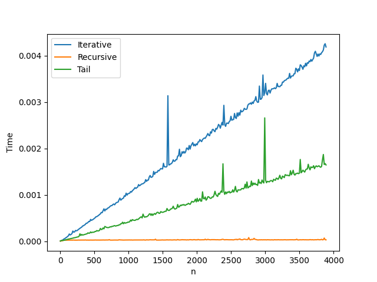

# Tarea 2 - CI3641 (Septiembre - Diciembre 2024)

**Hecho por**: Juan Cuevas _19-10056_

## Pregunta 1

Escoja algún lenguaje de programación de alto nivel y de propósito general cuyo nombre empiece con la misma letra que su apellido (por ejemplo, si su apellido es “Rodríguez”, podría escoger “Ruby”, “Rust”, “R”, etc.).

### Apéndice A

De una breve descripción del lenguaje escogido.

- Enumere y explique las estructuras de control de flujo que ofrece.
- Diga en qué orden evalúan expresiones y funciones.
  - ¿Tiene evaluación normal o aplicativa? ¿Tiene evaluación perezosa?
  - La evaluación de argumentos/operandos se hace de izquierda a derecha, de derecha a izquierda o en un orden arbitrario.

### Apéndice B

Implemente los siguientes programas en el lenguaje escogido:

- Considere la siguiente función:

  $$ f(n) = \begin{cases} n/2 & \text{si n es par} \\ 3n + 1 & \text{si n es impar} \end{cases} $$

  Definimos la función $\text{count}(n)$ como la cantidad de aplicaciones consectuvias de $f$ que se deben hacer sobre $n$, hasta que el resultado sea $1$.

  Por ejemplo: 
  $$f(42) = 21$$ 
  $$f(21) = 64$$
  $$f(64) = 32$$
  $$f(32) = 16$$
  $$f(16) = 8$$
  $$f(8) = 4$$
  $$f(4) = 2$$
  $$f(2) = 1$$
  
  Por lo tanto, $\text{count}(42) = 8$.

  Escriba un programa que, dado un entero $n$, calcule $\text{count}(n)$.

- Implemente el algoritmo Mergesort y explique los detalles de su implementación. 

  _Nota: Explicar los detalles no implica traducir línea por linea a lenguaje natural, sino explicar el funcionamiento a grandes rasgos y las decisiones de implementación._

### Respuesta

#### Apéndice A

El lenguaje de programación escogido es C++.

##### Estructuras de control de flujo

C++ ofrece las siguientes estructuras de control de flujo

- **Secuenciales**: Las instrucciones se ejecutan en el orden en que aparecen.
- **Selección**: Permite ejecutar un bloque de instrucciones si se cumple una condición.
  - `if`: Permite ejecutar un bloque de instrucciones si se cumple una condición.
  - `if-else`: Permite ejecutar un bloque de instrucciones si se cumple una condición y otro bloque si no se cumple.
  - `switch`: Permite ejecutar un bloque de instrucciones dependiendo del valor de una variable.
  - `?:`: Operador ternario que permite ejecutar un bloque de instrucciones si se cumple una condición y otro si no se cumple.
  - `if constexpr`: Permite ejecutar un bloque de instrucciones si se cumple una condición en tiempo de compilación.
  - `if constexpr-else`: Permite ejecutar un bloque de instrucciones si se cumple una condición en tiempo de compilación y otro si no se cumple.
  - `switch constexpr`: Permite ejecutar un bloque de instrucciones dependiendo del valor de una variable en tiempo de compilación.
  - `?: constexpr`: Operador ternario que permite ejecutar un bloque de instrucciones si se cumple una condición en tiempo de compilación y otro si no se cumple.
- **Iteración**: Permite ejecutar un bloque de instrucciones repetidamente.
  - `for`: Permite ejecutar un bloque de instrucciones un número determinado de veces.
  - `while`: Permite ejecutar un bloque de instrucciones mientras se cumpla una condición.
  - `do-while`: Permite ejecutar un bloque de instrucciones al menos una vez y luego mientras se cumpla una condición.
  - `for-range`: Permite iterar sobre un rango de valores.
  - `for-range constexpr`: Permite iterar sobre un rango de valores en tiempo de compilación.
  - `for-range-ref`: Permite iterar sobre un rango de valores por referencia.
- **Transferencia de control**: Permite cambiar el flujo de ejecución de un programa.
  - `break`: Permite salir de un bucle.
  - `continue`: Permite saltar a la siguiente iteración de un bucle.
  - `goto`: Permite saltar a una etiqueta en el código.
  - `return`: Permite salir de una función y devolver un valor.
  - `throw`: Permite lanzar una excepción.
  - `try-catch`: Permite capturar una excepción y manejarla.
  - `try-catch-else`: Permite capturar una excepción y manejarla si se lanza.
  - `try-catch-finally`: Permite capturar una excepción y manejarla y ejecutar un bloque de instrucciones al final.

##### Evaluación de expresiones y funciones

Particularmente, C++ tiene evaluación normal y aplicativa. Ademas, la evaluación de argumentos/operandos se hace de izquierda a derecha. C++ no tiene evaluación perezosa, por lo que todos los argumentos de una función se evalúan antes de llamar a la función. De igual forma, las expresiones se evalúan de izquierda a derecha en el orden en que aparecen a la hora de revisar una condición, y pese a que el resultado sea definitivo, se sigue evaluando el resto de la expresión.

Adicionalmente, C++ permite la sobrecarga de operadores, lo que permite definir el comportamiento de los operadores para tipos de datos personalizados.

#### Apéndice B

Para ejecutar el programa, se debe correr el siguiente comando:

```bash
./main exe1-b <n> 
```

Donde `<n>` es el número entero que se desea evaluar.

#### Apéndice C

Para ejecutar el programa, se debe correr el siguiente comando:

```bash
./main exe1-c <n1> <n2> <n3> ... <n>
```

Donde `<n1> <n2> <n3> ... <n>` son los números enteros que se desean ordenar.

##### Implementación

El algoritmo Mergesort es un algoritmo de ordenamiento que sigue la estrategia de divide y vencerás. Consiste en dividir la lista en dos mitades, ordenar cada mitad y luego combinar las dos mitades ordenadas. La implementación del algoritmo Mergesort en C++ es la siguiente:

```cpp
void merge(int arr[], int l, int m, int r){
    // Get the sizes of the two arrays
    int n1 = m - l + 1;
    int n2 = r - m;

    int L[n1], R[n2];

    // Copy the data to the two arrays
    for (int i = 0; i < n1; i++){
        L[i] = arr[l + i];
    }

    for (int i = 0; i < n2; i++){
        R[i] = arr[m + 1 + i];
    }

    int i = 0;
    int j = 0;
    int k = l;

    // Merge the two arrays
    while (i < n1 && j < n2){
        if (L[i] <= R[j]){
            arr[k] = L[i];
            i++;
        } else {
            arr[k] = R[j];
            j++;
        }
        k++;
    }

    // Copy the remaining elements of L[] and R[]
    while (i < n1){
        arr[k] = L[i];
        i++;
        k++;
    }

    while (j < n2){
        arr[k] = R[j];
        j++;
        k++;
    }
}

void mergeSort(int arr[], int l, int r){
    // If the left index is greater or equal to the right index, return
    if (l >= r){
        return;
    }

    // Get the middle index
    int m = l + (r - l) / 2;
    // Sort the two halves
    mergeSort(arr, l, m);
    mergeSort(arr, m + 1, r);
    // Merge the two halves
    merge(arr, l, m, r);
}
```

Se puede ver que el algoritmo Mergesort se divide en dos funciones: `merge` y `mergeSort`. La función `merge` se encarga de combinar dos arreglos ordenados en uno solo, mientras que la función `mergeSort` se encarga de dividir el arreglo en dos mitades, ordenar cada mitad y luego combinarlas.

Tomé la decisión de implementar el algoritmo Mergesort de esta forma para separar la lógica de combinar dos arreglos ordenados de la lógica de dividir el arreglo en dos mitades y ordenarlas. De esta forma, se puede reutilizar la función `merge` en otros algoritmos de ordenamiento que requieran combinar dos arreglos ordenados.

Adicionalmente, por simplicidad, decidí utilizar arreglos de tamaño fijo para almacenar los elementos de los dos arreglos que se van a combinar. Esto se debe a que el tamaño de los arreglos es conocido y no cambia durante la ejecución del programa. Además, crear subarreglos de tamaño fijo en la pila es más eficiente que utilizar memoria dinámica en este caso.

## Pregunta 2

Se desea que modele e implemente, en el lenguaje de su elección, un programa que maneje expresiones aritmáticas sobre enteros. Este programa debe cumplir con las siguientes características:

### Apéndice A

Debe saber tratar expresiones escritas en orden pre–fijo y post–fijo, con los siguientes operadores: 
- suma: Representada por el símbolo $+$. 
- resta: Representada por el símbolo $-$. 
- multiplicación: Representada por el símbolo $*$. 
- división entera: Representada por el símbolo $/$.

### Apéndice B

Una vez iniciado el programa, pedirá repetidamente al usuario una acción para proceder. Tal acción puede ser:

- `EVAL <orden> <expr>`: Representa una evaluación de la expresión en `<expr>`, que está escrita de acuerdo a `<orden>`.
  
  El orden solamente puede ser:
  - `PRE`: Que representa expresiones escritas en orden pre–fijo. 
  - `POST`: Que representa expresiones escritas en orden post–fijo.
  
  Por ejemplo:
  - `EVAL PRE + * + 3 4 5 7` deberá imprimir `42`. 
  - `EVAL POST 8 3 - 8 4 4 + * +` deberá imprimir `69`.
  
- `MOSTRAR <orden> <expr>`: Representa una impresión en orden in–fijo de la expresión en `<expr>`, que está escrita de acuerdo a `<orden>`.
  
  El <orden> sigue el mismo patrón que en el punto anterior. Su programa debe tomar la precedencia y asociatividad estándar, donde:
  
  - La suma y la resta tienen la misma precedencia. 
  - La multiplicación y la división entera tienen la misma precedencia. 
  - La multiplicación y la división entera tienen mayor precedencia que la suma y la resta. 
  - Todos los operadores asocian a izquierda.
  
  La expresión resultante debe tener la menor cantidad posible de paréntesis, de tal forma que la expresión mostrada como resultado tenga la misma semántica que la expresión que fue pasada como argumento a la acción. Por ejemplo: 
    
  - `MOSTRAR PRE + * + 3 4 5 7` deberá imprimir (3 + 4) * 5 + 7. 

  - `MOSTRAR POST 8 3 - 8 4 4 + * +` deberá imprimir 8 - 3 + 8 * (4 + 4).
  
- `SALIR`: Debe salir del programa. 

Al finalizar la ejecución de cada acción, el programa deberá pedir la siguiente acción al usuario. 

Investigue herramientas para pruebas unitarias y cobertura en su lenguaje escogido y agregue pruebas a su programa que permitan corroborar su correcto funcionamiento. Como regla general, su programa debería tener una cobertura (de líneas de código y de bifuración) mayor al 80%.

### Respuesta

Para ejecutar el programa, se debe correr el siguiente comando:

```bash
./main exe2
```

Para ejecutar las pruebas de cobertura, se debe correr el siguiente comando:

```bash
./main exe2-test
```

## Pregunta 3

Considere los siguientes iteradores, escritos en Python: 

### Apéndice A

El iterador suspenso: 

```python
def suspenso(a, b): 
    if b == []: 
        yield a 
    else: 
        yield a + b[0] 
        for x in suspenso(b[0], b[1:]): 
            yield x 
```

Tomando como referencia las constantes X, Y y Z planteadas en los párrafos de introducción del examen, considere también el siguiente fragmento de código que hace uso del iterador suspenso:

```python
for x in suspenso(X + Y + Z, [X, Y, Z]): 
    print x 
```

Ejecute, paso a paso, el fragmento de código mostrado (por lo menos al nivel de cada nuevo marco de pila creado) y muestre lo que imprime.

### Apéndice B

El iterador misterio: 

```python
def misterio(n):
    if n == 0: 
        yield [1] 
    else: 
        for x in misterio(n-1): 
            r = [] 
            for y in suspenso(0, x): 
                r = [*r, y] 
            yield r
```

Considere también el siguiente fragmento de código que hace uso del iterador misterio: 

```python
for x in misterio(5): 
    print x 
```

Ejecute, paso a paso, el fragmento de código mostrado (por lo menos al nivel de cada nuevo marco de pila creado) y muestre lo que imprime. 

_Nota: cómo ya conocemos el comportamiento del iterador suspenso no es necesario mostrar los pasos internos en el ciclo interno de misterio._

### Apéndice C

Dada una lista de enteros, queremos un iterador que devuelva todos los elementos de la lista en orden (de menor a mayor). 

Por ejemplo, para la lista `[1,3,3,2,1]`, los elementos en orden serían: 

`1 1 2 3 3` 

Implemente este iterador en el lenguaje de su preferencia. 

_Nota: el ordenamiento debe ser parte de la lógica del iterador. No es válido ordenar primero la lista y luego devolver los elementos de la lista previamente ordenada._

### Respuesta

#### Apéndice a

##### Variables Globales

| Variable | Valor |
|----------|-------|
| X        | 0     |
| Y        | 5     |
| Z        | 6     |
| suspenso | proc  |
| x        | -     |
| pc       | 7     |

##### Pila 1

| Variable |    Valor  | Índice |
|----------|-----------|--------|
| a        |     11    |    0   |
| b        | [0, 5, 6] |    1   |
| x        |     -     |    2   |
| pc       |     0     |    3   |

pc (3) cambia a 2

pc (3) cambia a 3

x (global) cambia a 11

pc (global) cambia a 8

pc (global) cambia a 7

pc (3) cambia a 4

##### Pilas 2

| Variable |    Valor  | Índice |
|----------|-----------|--------|
| a        |      0    |    4   |
| b        |   [5, 6]  |    5   |
| x        |     -     |    6   |
| pc       |     0     |    7   |

pc (7) cambia a 2

pc (7) cambia a 3

x (global) cambia a 5

pc (global) cambia a 8

pc (global) cambia a 7

pc (7) cambia a 4

##### Pilas 3

| Variable |    Valor  | Índice |
|----------|-----------|--------|
| a        |      5    |    8   |
| b        |      [6]  |    9   |
| x        |     -     |   10   |
| pc       |     0     |   11   |

pc (11) cambia a 2

pc (11) cambia a 3

x (global) cambia a 11

pc (global) cambia a 8

pc (global) cambia a 7

pc (11) cambia a 4

##### Pilas 4

| Variable |    Valor  | Índice |
|----------|-----------|--------|
| a        |      6    |   12   |
| b        |      []   |   13   |
| pc       |     0     |   15   |

pc (15) cambia a 1

x (10) cambia a 6

pc (11) cambia a 5

x (6) cambia a 6

pc (7) cambia a 5

x (2) cambia a 6

pc (3) cambia a 5

x (global) cambia a 6

pc (global) cambia a 8

**Eliminamos secuencialmente las pilas**

##### Impresión

11
5
11
6

#### Apéndice b

##### Variables Globales

| Variable | Valor |
|----------|-------|
| X        | 0     |
| Y        | 5     |
| Z        | 6     |
| misterio | proc  |
| x        | -     |
| y        | -     |
| pc       | 9     |

##### Pila 1

| Variable | Valor | Índice |
|----------|-------|--------|
| n        |   5   |    0   |
| x        |   -   |    1   |
| y        |   -   |    2   |
| r        |   -   |    3   |
| pc       |   0   |    4   |

pc (4) cambia a 3

##### Pila 2

| Variable | Valor | Índice |
|----------|-------|--------|
| n        |   4   |    5   |
| x        |   -   |    6   |
| y        |   -   |    7   |
| r        |   -   |    8   |
| pc       |   0   |    9   |

pc (9) cambia a 3

##### Pila 3

| Variable | Valor | Índice |
|----------|-------|--------|
| n        |   3   |   10   |
| x        |   -   |   11   |
| y        |   -   |   12   |
| r        |   -   |   13   |
| pc       |   0   |   14   |

pc (14) cambia a 3

##### Pila 4

| Variable | Valor | Índice |
|----------|-------|--------|
| n        |   2   |   15   |
| x        |   -   |   16   |
| y        |   -   |   17   |
| r        |   -   |   18   |
| pc       |   0   |   19   |

pc (19) cambia a 3

##### Pila 5

| Variable | Valor | Índice |
|----------|-------|--------|
| n        |   1   |   20   |
| x        |   -   |   21   |
| y        |   -   |   22   |
| r        |   -   |   23   |
| pc       |   0   |   24   |

pc (24) cambia a 3

##### Pila 6

| Variable | Valor | Índice |
|----------|-------|--------|
| n        |   0   |   25   |
| pc       |   0   |   26   |

pc (26) cambia a 1

x (17) cambia a [1]

**Salimos de la pila 6**

pc (24) cambia a 1

r (23) cambia a []

pc (24) cambia a 5

y (18) cambia a 1

pc (24) cambia a 6

r (23) cambia a [1]

pc (24) cambia a 5

y (18) cambia a 1

pc (24) cambia a 6

r (23) cambia a [1, 1]

pc (24) cambia a 7

x (16) cambia a [1, 1]

**Salimos de la pila 5**

pc (19) cambia a 5

r (18) cambia a []

pc (19) cambia a 6

y (17) cambia a 1

pc (19) cambia a 7

r (18) cambia a [1]

pc (19) cambia a 6

y (17) cambia a 2

pc (19) cambia a 7

r (18) cambia a [1, 2]

pc (19) cambia a 6

y (17) cambia a 1

pc (19) cambia a 7

r (18) cambia a [1, 2, 1]

pc (19) cambia a 8

x (11) cambia a [1, 2, 1]

**Salimos de la pila 4**

pc (14) cambia a 5

r (13) cambia a []

pc (14) cambia a 6

y (12) cambia a 1

pc (14) cambia a 7

r (13) cambia a [1]

pc (14) cambia a 6

y (12) cambia a 3

pc (14) cambia a 7

r (13) cambia a [1, 3]

pc (14) cambia a 6

y (12) cambia a 3

pc (14) cambia a 7

r (13) cambia a [1, 3, 3]

pc (14) cambia a 6

y (12) cambia a 1

pc (14) cambia a 7

r (13) cambia a [1, 3, 3, 1]

pc (14) cambia a 8

x (6) cambia a [1, 3, 3, 1]

**Salimos de la pila 3**

pc (9) cambia a 5

r (8) cambia a []

pc (9) cambia a 6

y (7) cambia a 1

pc (9) cambia a 7

r (8) cambia a [1]

pc (9) cambia a 6

y (7) cambia a 4

pc (9) cambia a 7

r (8) cambia a [1, 4]

pc (9) cambia a 6

y (7) cambia a 6

pc (9) cambia a 7

r (8) cambia a [1, 4, 6]

pc (9) cambia a 6

y (7) cambia a 4

pc (9) cambia a 7

r (8) cambia a [1, 4, 6, 4]

pc (9) cambia a 6

y (7) cambia a 1

pc (9) cambia a 7

r (8) cambia a [1, 4, 6, 4, 1]

pc (9) cambia a 8

x (5) cambia a [1, 4, 6, 4, 1]

**Salimos de la pila 2**

pc (4) cambia a 5

r (3) cambia a []

pc (4) cambia a 6

y (2) cambia a 1

pc (4) cambia a 7

r (3) cambia a [1]

pc (4) cambia a 6

y (2) cambia a 5

pc (4) cambia a 7

r (3) cambia a [1, 5]

pc (4) cambia a 6

y (2) cambia a 10

pc (4) cambia a 7

r (3) cambia a [1, 5, 10]

pc (4) cambia a 6

y (2) cambia a 10

pc (4) cambia a 7

r (3) cambia a [1, 5, 10, 10]

pc (4) cambia a 6

y (2) cambia a 5

pc (4) cambia a 7

r (3) cambia a [1, 5, 10, 10, 5]

pc (4) cambia a 6

y (2) cambia a 5

pc (4) cambia a 7

r (3) cambia a [1, 5, 10, 10, 5, 1]

pc (4) cambia a 8

x (global) cambia a [1, 5, 10, 10, 5, 1]

**Salimos de la pila 1**

pc (global) cambia a 10

**Eliminamos secuencialmente las pilas**

##### **Impresión**

[1, 5, 10, 10, 5, 1]

#### Apéndice c

Para ejecutar el programa, se debe correr el siguiente comando:

```bash
./main exe3-c
```

## Pregunta 4

Considere la siguiente definición para una familia de funciones:

$$ F_{\alpha, \beta}(n) = \begin{cases} n & \text{si } 0 \leq n < \alpha \times \beta \\ \sum_{i=1}^{\alpha} F_{\alpha, \beta}(n - \beta \times i) & \text{si } n \geq \alpha \times \beta \end{cases} $$

Tomando como referencia las constantes X, Y y Z planteadas en los párrafos de introducción del examen, definamos: 
- $\alpha = ((X + Y) \text{ mod } 5) + 3$ 
- $\beta = ((Y + Z) \text{ mod } 5) + 3$

Se desea que realice implementaciones, en el lenguaje imperativo de su elección:

### Apéndice A

Una subrutina recursiva que calcule $F_{\alpha, \beta}$ para los valores de $\alpha$ y $\beta$ obtenidos con las fórmulas mencionadas anteriormente. Esta implementación debe ser una traducción directa de la fórmula resultante a código.

### Apéndice B

Una subrutina recursiva de cola que calcule $F_{\alpha, \beta}$.

### Apéndice C

La conversión de la subrutina anterior a una versión iterativa, mostrando claramente cuáles componentes de la implementación recursiva corresponden a cuáles otras de la implementación iterativa.

Debe usar el mismo el lenguaje para estos tres ejercicios y asegurarse que su lenguaje tenga las estructuras de control de flujo necesarias para realizarlos (su lenguaje escogido debe, por tanto, ser imperativo). 

Realice también un análisis comparativo entre las tres implementaciones realizadas, mostrando tiempos de ejecución para diversos valores de entrada y ofreciendo conclusiones sobre la eficiencia. Es recomendable que se apoye en herramientas de visualización de datos (como los plots de Matlab, R, Octave, Excel, etc.)

### Respuesta

Para ejecutar el programa, se debe correr el siguiente comando:

```bash
./main exe4 <n>
```

Donde `<n>` es el número entero que se desea evaluar.

Para realizar el análisis comparativo, se debe correr el siguiente comando:

```bash
./main exe4-analysis <n>
```

Donde `<n>` es el número de pruebas que se desean realizar.

> [!WARNING] Importante
> Es necesario instalar `matplotlib` y `pandas` para la ejecucion del programa de analisis. 
> Puede hacer dicha instalacion con el comando:
> ```bash
> pip install -r requirements.txt
> ```


En la ultima prueba realizada se obtuvieron los siguientes resultados:

<!-- n   iterative   recursive        tail
mean   1944.500000    0.002060    0.000029    0.000843
std    1127.707852    0.001211    0.000007    0.000502
min       1.000000    0.000006    0.000002    0.000003
25%     972.750000    0.001018    0.000025    0.000408
50%    1944.500000    0.002086    0.000029    0.000848
75%    2916.250000    0.003104    0.000031    0.001270
max    3888.000000    0.004260    0.000078    0.002660 -->

**Números de pruebas**: 300

|                     |      n      | Tiempo de Version Iterativa | Tiempo de Version Recursiva | Tiempo de Version Recursiva de Cola |
|---------------------|-------------|-----------------------------|-----------------------------|-------------------------------------|
| Promedio            |    1944.5   |           0.002060          |             0.000029        |               0.000843              |
| Desviación estándar | 1127.707852 |           0.001211          |             0.000007        |               0.000502              |
| Mínimo              |      1      |           0.000006          |             0.000002        |               0.000003              |
| 25%                 |    972.75   |           0.001018          |             0.000025        |               0.000408              |
| 50%                 |    1944.5   |           0.002086          |             0.000029        |               0.000848              |
| 75%                 |   2916.25   |           0.003104          |             0.000031        |               0.001270              |
| Máximo              |     3888    |           0.004260          |             0.000078        |               0.002660              |

<!-- Imagen de resultados -->
[](exercise4/results.png)

Se puede observar que la versión iterativa es la más lenta, seguida por la versión recursiva de cola y finalmente la versión recursiva. Esto se debe a que la versión iterativa tiene que realizar más operaciones que las versiones recursivas, ya que tiene que mantener un estado interno y realizar operaciones adicionales para simular la recursión. La versión recursiva de cola es más eficiente que la versión recursiva, ya que evita el uso de la pila de llamadas y realiza menos operaciones en cada llamada recursiva. La versión recursiva es la más eficiente, ya que realiza menos operaciones en cada llamada recursiva y no tiene que mantener un estado interno.

En general, la versión recursiva es la más eficiente para este problema, seguida por la versión recursiva de cola y finalmente la versión iterativa. Sin embargo, la diferencia en eficiencia entre las tres versiones es pequeña y puede variar dependiendo del lenguaje de programación y del compilador utilizado.

Particularmente, en Python, se utilizaron metodos de optimización para mejorar el rendimiento de las versiones recursivas, como la memorización de resultados y la eliminación de llamadas recursivas innecesarias. Esto permitió que se elevara el valor de n hasta alrededor 3900 sin problemas de límites de recursión.

## Pregunta 5

Considere la misma función maldad, definida en el parcial anterior:

$$\text{maldad}(n) = trib(\lfloor \log_2(N(n, \lfloor \log_2(n) \rfloor)) \rfloor + 1)$$

Decimos que unprogramaes políglota si el mismo código fuente puede ser compilado/interpretado por al menos dos diferentes lenguajes de programación. 

Desarrolle un programa políglota que: 

- Reciba por entrada estándar o argumento del sistema un valor para n, tal que $n \geq 2$ (esto puede suponerlo, no tiene que comprobarlo). Debe indicar en su informe claramente si su reto recibe la entrada vía entrada estándar o argumento del sistema.  
- Imprima el valor de $\text{maldad}(n)$. 
 
Su programa debe imprimir el valor correcto y tomando menos de 1 segundo de ejecución, por lo menos hasta $n = 50$ en todos los lenguajes de programación considerados.

### Respuesta

#### Java como archivo principal

Un lenguaje que se puede ejecutar con interpretes/compiladores diferentes es Java, ya que gracias a la JVM, se puede ejecutar el mismo codigo con interpretes de lenguajes como Kotlin, Scala, Groovy, etc.

Primeramente, se debe compilar el programa en Java con el siguiente comando:

```bash
javac Main.java && jar cvf Main.jar Main.class
```

Luego, para ejecutar el programa en Java, se debe correr el siguiente comando:

```bash
java Main <n>
```

Donde `<n>` es el número entero que se desea evaluar.

Para ejecutar el programa ya compilado anteriormente en Kotlin, se debe correr el siguiente comando:

```bash
kotlin Main <n>
```

Donde `<n>` es el número entero que se desea evaluar.

Para ejecutar el programa con JRuby, se debe correr el siguiente comando:

```bash
jruby -e 'require "java"; java_import "Main"; Main.main(["<n>"])'
```

Para ejecutar el programa ya compilado anteriormente en Groovy, se debe correr el siguiente comando:

```bash
groovy -cp Main.jar -e 'import Main; def main = new Main(); main.main("<n>")'
```

Donde `<n>` es el número entero que se desea evaluar.

#### Python como archivo principal

Otro lenguaje que se puede ejecutar con interpretes/compiladores diferentes es Python, ya que gracias a la JVM, se puede ejecutar el mismo codigo con interpretes de lenguajes como Jython, además de otros lenguajes como Ruby, Perl, etc.

Para ejecutar el programa en Python, se debe correr el siguiente comando:

```bash
python main.py <n>
```

Donde `<n>` es el número entero que se desea evaluar.

Para ejecutar el programa en Ruby, se debe correr el siguiente comando:

```bash
ruby -e "require 'open3'; Open3.popen3('python main.py <n>') { |stdin, stdout, stderr, wait_thr| puts stdout.read }"
```

Donde `<n>` es el número entero que se desea evaluar.

Para ejecutar el programa en Perl, se debe correr el siguiente comando:

```bash
perl -e 'system("python main.py <n>")'
```

Donde `<n>` es el número entero que se desea evaluar.

Para ejecutar el programa en PHP, se debe correr el siguiente comando:

```bash
php -r 'system("python main.py <n>");'
```

Donde `<n>` es el número entero que se desea evaluar.
